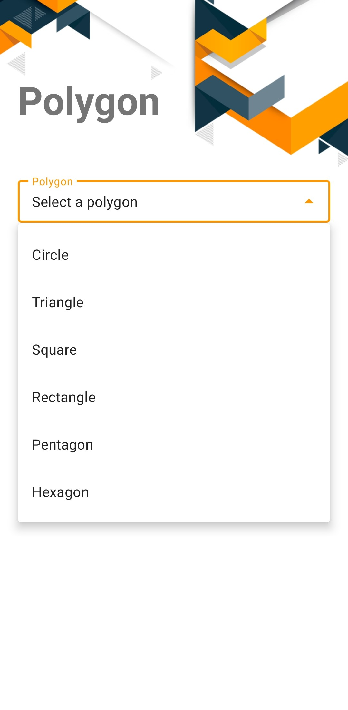
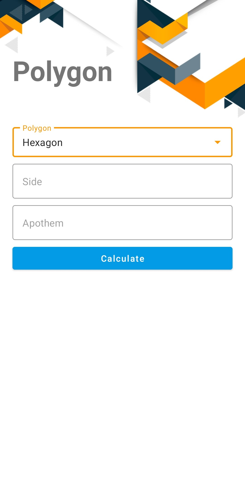
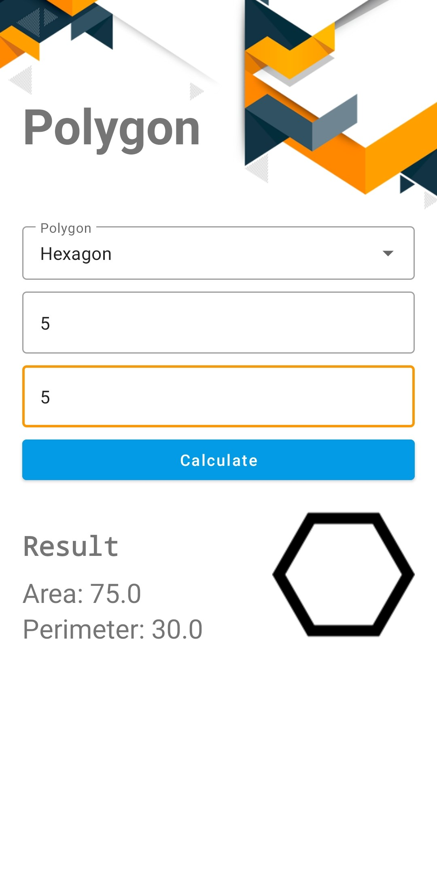

# Polygon Application
## Description


Android application programmed in Java programming language and MVVM Arquitecture. Developed under a OOP paradigm with Abstraction, Encapsulation, Inheritance and Polymorphism. Using design guides with Material Design. Binding views with DataBinding
 that allows the user to calculate the area and perimeter of basic polygons: 
* Circle, Triangle, Square, Rectangle, Pentagon, Hexagon


## Features

* Calculate area of a polygon
* Calculate perimeter of a polygon

## Technologies

* Java
* Data Binding
* MVVM
* LiveData
* ViewModel
* Material Design
* Navigation Component
* OOP

## Instalation

1. Clone this repository

```
    git clone https://github.com/lizarragabriel/Polygon.git
```

## Screens

<table>
    <tr>
        <td></td>
        <td></td>
        <td></td>
        <td></td>   
    </tr>
</table>